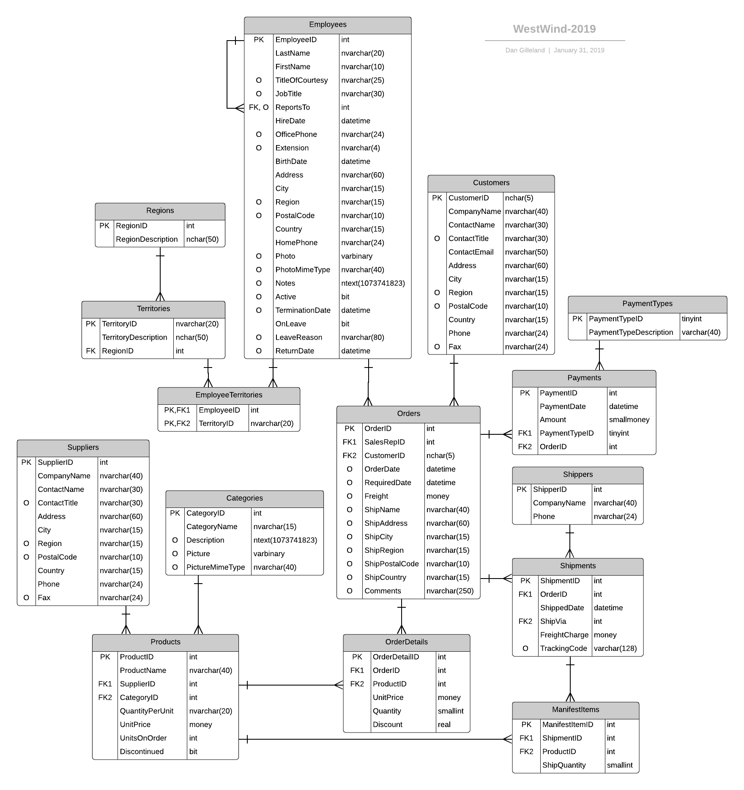

# WestWind for DMIT-1508

> **Setup:** Download and install the `.bacpac` file from the [latest release of the database](https://github.com/dgilleland/West-Wind-Wholesale/releases/tag/v2.0.0).

Remeber to enter the following at the top of your sql code:

```sql
USE WestWind
GO
```

## Practice Questions

1. Select the shippers who have had more than 700 shipments.
1. Select the shipments that happened in May 2018. Group the results by the order id and display the order id and total freight charges for each order. (You will need to use date functions)
1. Identify the customer whose individual shipment was the largest. Show the customer's Company Name, Contact Name, and Contact Email.
1. How many products are in each category? Display the Category Name and the number of products.
1. Add "Bitcoin" as a new payment type.
1. Display the payment types that have not been used.
1. Creat a view called OrderShipments that includes the Order ID, Customer ID, RequiredDate, ShippedDate, CompanyName of the Shipper, and the shipment's FreightCharge.
1. Using the OrderShipments view, select the customer's company name and the total freight charges for shipments to the customer.
1. A shipment was lost in an air crash. Delete the manifest items for shipment id 700.
1. Update the freight charge for shipment 700 and set it to zero (no charge for lost shipments).

----


