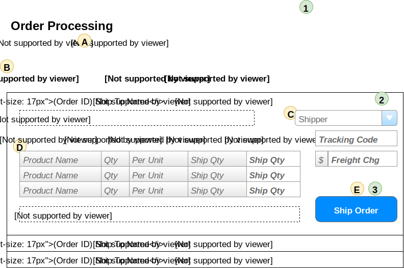

# Order Processing

> Orders are shipped directly from our suppliers to our customers. As such, suppliers log onto our system to see what orders there are for the products that they provide.

## User Interface

Suppliers will be interacting with a page that shows the following information.


The information shown here will be displayed in a **ListView**, using the *EditItemTemplate* as the part that shows the details for a given order.

### Events and Interactions



-  - **Page_Load** event
  -  - Supplier/Contact names obtained from who the logged-in user is.
  -  - Load the ListView data
    - **`List<OutstandingOrder> OrderProcessingController.LoadOrders(SupplierID)`**
  -  - Load the list of shippers
    - **`List<ShipperSelection> OrderProcessingController.ListShippers()`**
-  - **EditCommand** click event
  - Default EditCommand behaviour of the ListView
  - `<EditItemTemplate>` will display the extended information of the Products List  and other order information.
-  - **ShipOrder** click
  - Use a custom command name of "ShipOrder" and handle in the ListView's ItemCommand event.
  - Gather information from the form for the products to be shipped and the shipping information. This is sent to the **`void OrderProcessingController.ShipOrder(int orderId, ShippingDirections shipping, List<ProductShipment> products)`**

## POCOs/DTOs

The POCOs/DTOs are simply classes that will hold our data when we are performing Queries or issuing Commands to the BLL.

### Queries

```csharp
public class ShipperSelection
{
    public int ShipperId { get; set; }
    public string Shipper { get; set; }
}
```

```csharp
public class OutstandingOrder
{
    public int OrderId { get; set; }
    public string ShipToName { get; set; }
    public DateTime OrderDate { get; set; }
    public DateTime RequiredBy { get; set; }
    public TimeSpan DaysRemaining { get; } // Calculated
    public IEnumerable<OrderProductInformation> OutstandingItems { get; set; }
    public string FullShippingAddress { get; set; }
    public string Comments { get; set; }
}
```

```csharp
public class OrderProductInformation
{
    public int ProductId {get;set;}
    public string ProductName {get;set;}
    public short Qty {get;set;}
    public string QtyPerUnit {get;set;}
    public short Outstanding {get;set;}
    // NOTE: Outstanding <= OrderDetails.Quantity - Sum(ManifestItems.ShipQuantity) for that product/order
}
```

### Commands

```csharp
public class ShippingDirections
{
    public int ShipperId { get; set; }
    public string TrackingCode { get; set; }
    public decimal? FreightCharge { get; set; }
}
```

```csharp
public class ProductShipment
{
    public int ProductId { get; set; }
    public int ShipQuantity { get; set; }
}
```

## BLL Processing

All product shipments are handled by the **`OrderProcessingController`**. It supports the following methods.

- **`List<OutstandingOrder> LoadOrders(int supplierId)`**
  - **Validation:**
    - Make sure the supplier ID exists, otherwise throw exception
    - [Advanced:] *Make sure the logged-in user works for the identified supplier.*
  - Query for outstanding orders, getting data from the following tables:
    - TODO: List table names
- **`List<ShipperSelection> ListShippers()`**
  - Queries for all the shippers.
- **`void ShipOrder(int orderId, ShippingDirections shipping, List<ProductShipment> products)`**
  - **Validation:**
    - OrderId must be valid
    - products cannot be an empty list
    - Products identified must be on the order
    - Quantity must be greater than zero and less than or equal to the quantity outstanding
    - Shipper must exist
    - Freight charge must either be null (no charge) or > $0.00
  - Processing (tables/data that must be updated/inserted/deleted/whatever)
    - Create new Shipment
    - Add all manifest items
    - Check if order is complete; if so, update Order.Shipped
