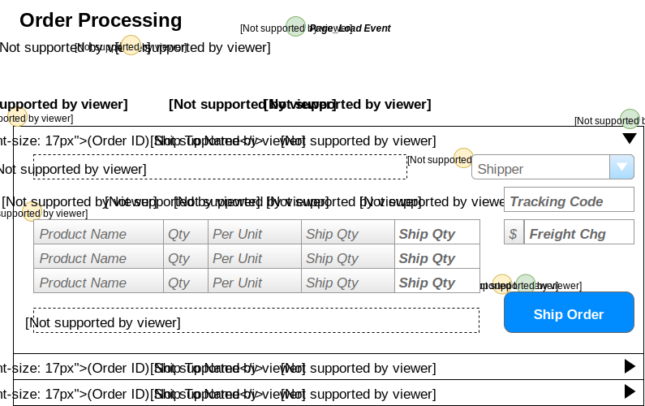

# Order Processing

> Orders are shipped directly from our suppliers to our customers. As such, suppliers log onto our system to see what orders there are for the products that they provide.

## User Interface

Suppliers will be interacting with a page that shows the following information.


The information shown here will be displayed in a **ListView**, using the *EditItemTemplate* as the part that shows the details for a given order.

## Events and Interactions



-  - **Page_Load** event
  -  - Supplier/Contact names obtained from who the logged-in user is.
  -  - Load the ListView data from BLL
    - **`List<OutstandingOrder> OrderProcessingController.LoadOrders(supplierId)`**
  -  - Load the list of shippers from BLL
    - **`List<ShipperSelection> OrderProcessingController.ListShippers()`
-  - **EditCommand** click event
  - Default EditCommand behaviour of the ListView
  - `<EditItemTemplate>` will display the extended information of the products  and other details of the order.
-  - **ShipOrder** click
  - Use a custom command name of "ShipOrder" and handle in the ListView's `ItemCommand` event.
  - Gather information from the form of the products to be shipped and the shipping information. This is sent to the following method in the BLL for processing:
    ```csharp
    void OrderProcessingController.ShipOrder(int orderId, ShippingDirections shipping, List<OrderItem> items)
    ```

## POCOs

### Commands

### Queries

```csharp
public class OrderItem
{
    public int ProductID {get;set;}
    public string ProductName {get;set;}
    public short Qty {get;set;}
    public string QtyPerUnit {get;set;}
    public short Outstanding {get;set;} // Calculated as OD.Quantity - Sum(Shipped qty)
}
```

## BLL Processing
