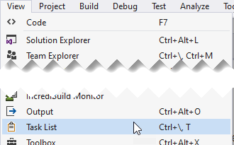

# Entity Framework Review

## West-Wind Console 

This demo and practice solution uses Entity Framework (*EF*) to access the **West Wind Wholesale** database (download the [**latest release**](https://github.com/dgilleland/West-Wind-Wholesale/releases)). It illustrates basic concepts of EF regarding the entity and `DbContext` classes (properties for columns, attributes for keys/constraints) and expands on this by introducing **Navigational Properties** to represent the relational aspects of the database.

When you open the solution in Visual Studio, take a look at the "TODO" messages (under the *View* menu, select *Task List*). There you will find references to review items and practice problems you can do on your own.

### ERD - West Wind Wholesale

