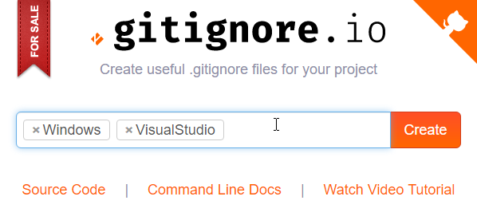
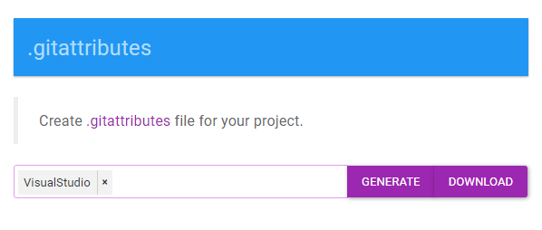
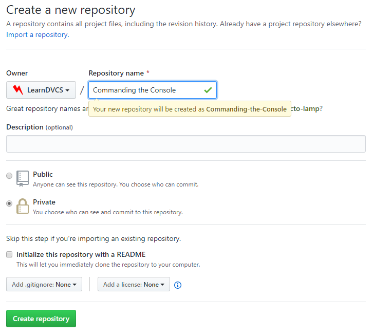
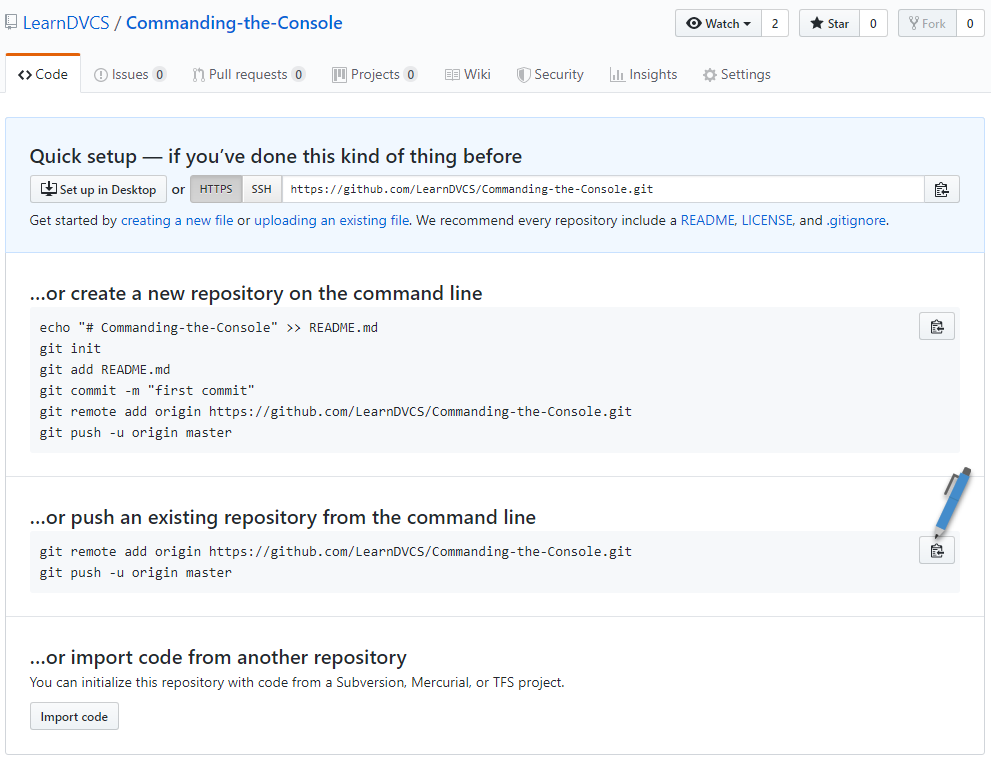

# git in the Console

In this tutorial, you will need [Visual Studio Code](https://code.visualstudio.com) (*a.k.a. - VS Code*) - a text editor with a built-in terminal (command line) interface in which we will enter various git commands. Along the way, we will get introduced to **Markdown** syntax - a way of "formatting" code in a plain-text editor so that it can be transformed into HTML.

**git** is a program designed to work from the command line. As a command-line interface (CLI), every command will begin with `git` - the name of the program. In this tutorial, we will use the following git commands:

- `git init` - This command is used to initialize (set up) a git repository in the current directory. When a git repository is set up, there will be a hidden folder named ".git" that contains all the history of commits for the repository.
- `git status` - This command is used to give you the status of your code repository.
- `git add .` - This command is used to stage un-tracked and modified files for a commit. If a file is not being tracked (and is not listed in .gitignore), this command will mark the file as a new item for the repository to track. If a file has been modified, then this command will mark it as ready to be committed.
- `git commit -m "message"` - The commit command is used to save staged files to the repository. When a commit occurs, all of the files staged for committal are compared against the last commit, and the changes between them becomes the new commit. Additionally, the user is identified for the commit (typically by a user name and e-mail) - this is called blame.
- `git log` - This command is used to display information on previous commits in your history.
- `git remote -v` - This command is used to view the remote repositories referenced by your local machine.
- `git remote add name uri` - This command is used to add a remote repository. Replace the `name` with a short identifier of your remote and the `uri` with the location of that remote repository.
- `git push` - This command is used to take the local repository and send/merge it with a remote repository.
- `git pull` - This command is used to get a remote repository and merge it with the local repository. Remote repositories are typically hosted online.

## Creating a Repository


In VS Code, open a folder to work in, giving that folder a name of **Commanding the Console**. Then, press the **ctrl** + **`** key combination to open the terminal editor. In that editor, type the following git command:

> ```ps
> git init
> ```

Right now, your repository folder is empty (except for the hidden folder named *.git*). Typically, we want to have a few files as part of our code repositories:

- **ReadMe.md** - In this file, you present key information about your repository for anyone using it. (***Note:** Treat all file names as case-sensitive, because git does.*)
- **.gitignore** - Here, you identify the types of files that you do **not** want to "track" in your code repository; they can exist in your repository folder, but they will be ignored by default when it comes to commiting snapshots of your code.
- **.gitattributes** - This file give git guidance on how to "normalize" certain text files for different operating systems.

### Make the ReadMe file

Let's begin with the **ReadMe.md** file. Create the file using the *File* menu or pressing **ctrl** + **n**. Inside the file, type the following markdown code.

```md
# Commanding the Console

This is a refresher of git and using git on the command line.

```

Now, open the terminal (**ctrl** + **`**) and type the following command:

> ```ps
> git status
> ```

This identifies what files are new/modified/deleted in your repository and what files are ready to be commited. To save a snapshot of what's changed, you do a two-step process:

1. Identify the items you want to commit
1. Commit the changes

In the terminal, enter the following and note the difference in the result of checking the status of your repository.

> ```ps
> git add ReadMe.md
> git status
> ```

> **Note:** Remember how I said that git is case sensitive? Well, if you get a response that git can't find the file, check your typing - upper and lower-case matter, *and* it's best to avoid spaces in your folders and file names.

Now, commit the changes:

> ```ps
> git commit -m "Created ReadMe file"
> git status
> ```

To see the history of your commits so far, type `git log` in the terminal.

## Make the .gitignore and .gitattributes Files

You seldom will need to write your own `.gitignore` and `.gitattributes` files by hand. Getting the contents of these files from online websites is easiest (and probably the most reliable too). Begin by creating two files in your repository and name them `.gitignore` and `.gitattributes` - note that the file names start with a dot.

Open a browser window and go to [GitIgnore.io](https://gitignore.io) and enter "windows" and "visualstudio" as the templates to use. Click the "Create" button, and copy the contents of the resulting page into your `.gitignore` file.



You're going to do the same with your `.gitattributes`. This time, go to [GitAttributes.io](https://gitattributes.io/) and enter "visualstudio" as your template; then copy the results to your local file.



Save a snapshot of all your changes. In the following code, note that I use a dot (`.`) in my `git add` statement. This is a "wildcard" that tells git to stage all the changes that have occurred in this folder and all subfolders.

> ```ps
> git add .
> git commit -m "Added .gitattributes and .gitignore"
> ```

## Saving to the [Cloud](https://github.com)

At this point, you have a **local** repository. It's a good idea to also have a copy of this in the cloud - this is known as having a **remote** repository. The online git hosting company we're using here is [GitHub](https://github.com). If you haven't already signed up for GitHub, now's a good time to do so!

To set up our remote, we need to create a spot for it on GitHub ([Create New Repository](https://help.github.com/en/articles/create-a-repo)). When you create this repository, you will want it to be an **empty** repository. This is because we've already got our local repo, and we want to push it up to GitHub. Fill out the Create Repository form as follows.



GitHub will inform you of steps you can follow to create content for your repository. We want to import our existing local repo, so enter the commands listed by GitHub.



You can view information on your remotes by entering the following in the terminal.

> ```ps
> git remote -v
> ```

Go back to your browser and refresh the page - you will see your uploaded contents. You can also edit the files directly from your browser. Click the pencil icon for the ReadMe file so you can edit the contents of this file, and append the following to the end of that document. Then click the "Commit" button.

```markdown
## Tips and Tricks

- Making Commits:
  - Commit messages should be short and meaningful
  - Make frequent commits
- VS Code Keyboard Shortcuts
  - **ctrl** + **`** for toggling the terminal window
  - **ctrl** + **k** followed by **s** to "Save All"
```

At this point, your remote repository has changes that don't exist in your local repository. When synchronizing your local and remote repositories, you should always pull before you push. Issue a pull command in your terminal.

> ```ps
> git pull
> ```

Now, make some more changes to your local copy of the ReadMe file. Let's add an image!

```markdown

```

Commit your changes, and then push them to the cloud.

> ```ps
> git add ReadMe.md
> git commit -m "Add thoughtful comic"
> git push
> ```

## Readings

Here are some further readings on version control.

- [Version Control in Software Development](https://dmit-2018.github.io/topics/dvcs/)
- [git Basics](https://dmit-2018.github.io/topics/dvcs/gh4w.html#signing-up-with-github-com)
- [Resolving Merge Conflicts](https://dmit-2018.github.io/topics/dvcs/conflicts/)

----

## Overview

In this tutorial, we covered the following.

> ## Tasks
>
> - Create a repository from the command line **Commanding the Console**
>   - `git init`
>   - *ReadMe.md*
>   - `git status`
>   - `git add ReadMe.md`
>   - `git commit`
>   - `git log`
>   - *.gitignore* + *.gitattributes* - content from website
>   - `git add .` & commit
> - Setup on GitHub
>   - `git remote -v`
>   - Blank repo on GitHub
>   - add remote and push
>   - ReadMe - Tips on commits: small, frequent, good messages
>   - add/commit/status
>   - Edit ReadMe for new section on git commands
>
> 
