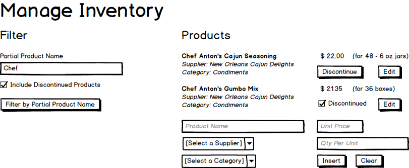

# Manage Product Catalog

Illustrates:

- Object Data Source constrols
  - for CRUD
  - Queries
  - Paramaterized queries
- ListView for CRUD



## BLL

### Query

```csharp
#region Supplier/Category Supporting Lists
[DataObjectMethod(DataObjectMethodType.Select)]
public List<KeyValuePair<int, string>> ListSuppliersNameAndId()
{
    using (var context = new WestWindContext())
    {
        var suppliers = from company in context.Suppliers.ToList()
                        // use .ToList() because KeyValuePair<,> does not translate to SQL
                        select new KeyValuePair<int, string>(company.SupplierID, company.CompanyName);
        return suppliers.ToList();
    }
}

[DataObjectMethod(DataObjectMethodType.Select)]
public List<KeyValuePair<int, string>> ListCategoriesNameAndId()
{
    using (var context = new WestWindContext())
    {
        // use .ToList() because KeyValuePair<,> does not translate to SQL
        var suppliers = from company in context.Categories.ToList()
                        select new KeyValuePair<int, string>(company.CategoryID, company.CategoryName);
        return suppliers.ToList();
    }
}
#endregion
```

```csharp
[DataObjectMethod(DataObjectMethodType.Select)]
public List<ProductInfo> FilterProducts(string partialName, bool includeDiscontinued)
{
    using (var context = new WestWindContext())
    {
        var results = from item in context.Products
                      where item.ProductName.Contains(partialName)
                          && (item.Discontinued == includeDiscontinued || !item.Discontinued)
                      select new ProductInfo
                      {
                          ProductId = item.ProductID,
                          Name = item.ProductName,
                          Price = item.UnitPrice,
                          QtyPerUnit = item.QuantityPerUnit,
                          Supplier = item.Supplier.CompanyName,
                          Category = item.Category.CategoryName,
                          SupplierId = item.SupplierID,
                          CategoryId = item.CategoryID,
                          IsDiscontinued = item.Discontinued
                      };
        return results.ToList();
    }
}
```

### Command

```csharp
[DataObjectMethod(DataObjectMethodType.Insert)]
public void AddProductItem(ProductInfo info)
{
    // Step 0: Validation
    if (info == null)
        throw new ArgumentNullException(nameof(info), $"No {nameof(ProductInfo)} was supplied for adding a new product to the catalog.");
    if (info.Price <= 0)
        throw new ArgumentOutOfRangeException(nameof(info.Price), $"The supplied price of {info.Price} must be greater than zero.");

    // Step 1: Process the request by adding a new Product to the database
    using (var context = new WestWindContext())
    {
        var newItem = new Product
        {
            ProductName = info.Name?.Trim(), // Null Conditional Operator  ?.
            QuantityPerUnit = info.QtyPerUnit?.Trim(),
            UnitPrice = info.Price,
            CategoryID = info.CategoryId,
            SupplierID = info.SupplierId
        };
        context.Products.Add(newItem);
        context.SaveChanges(); // This will cause all the validation attributes to be checked
    }
}

[DataObjectMethod(DataObjectMethodType.Update)]
public void UpdateProductItem(ProductInfo info) // ProductInfo is our POCO class
{
    // Step 0: Validation
    if (info == null)
        throw new ArgumentNullException(nameof(info), $"No {nameof(ProductInfo)} was supplied for updating an existing product in the catalog.");
    if (info.Price <= 0)
        throw new ArgumentOutOfRangeException(nameof(info.Price), $"The supplied price of {info.Price} must be greater than zero.");

    // Step 1: Process the request by modifying an existing Product in the database
    using (var context = new WestWindContext())
    {
        // Note to Self: When doing an update for an existing item,
        //               do a .Find() or a .Attach() to load up the
        //               item from the database.
        var given = context.Products.Find(info.ProductId);
        // Assuming I will get a null if the product does not exist
        if (given == null)
            throw new ArgumentException($"The given product id of {info.ProductId} does not exist in the database.", nameof(info.ProductId));

        // Update the found product with the given information
        given.ProductName = info.Name;
        given.UnitPrice = info.Price;
        given.QuantityPerUnit = info.QtyPerUnit;
        given.CategoryID = info.CategoryId;
        given.SupplierID = info.SupplierId;

        // Grab a DbEntityEntry<Product>, with which I can say what's been changed.
        var existing = context.Entry(given); // .Entry() will look for the Product obj with a matching ID
        // Specify which Product properties I've modified, 'cause I don't want to lose
        // the .Discontinued or the .UnitsOnOrder values.
        existing.Property(nameof(given.ProductName)).IsModified = true;
        existing.Property(nameof(given.UnitPrice)).IsModified = true;
        existing.Property(nameof(given.QuantityPerUnit)).IsModified = true;
        existing.Property(nameof(given.CategoryID)).IsModified = true;
        existing.Property(nameof(given.SupplierID)).IsModified = true;

        // Update the database
        context.SaveChanges();
    }
}

[DataObjectMethod(DataObjectMethodType.Delete)]
public void DiscontinueProductItem(ProductInfo info)
{
    if (info == null)
        throw new ArgumentNullException(nameof(info), "No Product Info was supplied for discontinuing.");
    using (var context = new WestWindContext())
    {
        var existing = context.Products.Find(info.ProductId);
        if (existing == null)
            throw new ArgumentException("The product was not found", nameof(info.ProductId));
        existing.Discontinued = true;
        var entry = context.Entry(existing);
        entry.Property(x => x.Discontinued).IsModified = true;
        context.SaveChanges();
    }
}
```

## Web Form

```xml
<h2>Filter</h2>
<asp:Label ID="Label1" runat="server" AssociatedControlID="PartialName">Partial Product Name</asp:Label>
<asp:TextBox ID="PartialName" runat="server" CssClass="form-control" placeholder="Enter partial product name" />
<br />
<asp:CheckBox ID="IncludeDiscontinued" runat="server" Text="Include Discontinued Products" />
<asp:LinkButton ID="Filter" runat="server" CssClass="btn btn-primary">Filter by Partial Name</asp:LinkButton>
```

```xml
<asp:ListView ID="ProductListView" runat="server"
      DataSourceID="ProductDataSource" InsertItemPosition="LastItem"
      ItemType="WestWindSystem.DataModels.ProductInfo"
      DataKeyNames="ProductId">
    <EditItemTemplate>
        <div class="row" style="border-bottom: solid 1px lightgray">
            <div class="col-sm-8">
                <asp:TextBox ID="ProductName" runat="server"
                      Text="<%# BindItem.Name %>" CssClass="form-control"
                      placeholder="Product Name" required="required" />

                <asp:DropDownList ID="SupplierDropDown" runat="server"
                    CssClass="form-control"
                    SelectedValue="<%# BindItem.SupplierId %>"
                    AppendDataBoundItems="true" DataSourceID="SupplierDataSource"
                    DataTextField="Value" DataValueField="Key">
                    <asp:ListItem Value="0">[Select a Supplier]</asp:ListItem>
                </asp:DropDownList>

                <asp:DropDownList ID="CategoryDropDown" runat="server"
                    CssClass="form-control"
                    SelectedValue="<%# BindItem.CategoryId %>"
                    AppendDataBoundItems="true" DataSourceID="CategoryDataSource" 
                    DataTextField="Value" DataValueField="Key">
                    <asp:ListItem Value="0">[Select a Category]</asp:ListItem>
                </asp:DropDownList>
            </div>
            <div class="col-sm-4">
                <asp:TextBox ID="UnitPrice" runat="server" CssClass="form-control"
                    Text="<%# BindItem.Price %>" TextMode="Number"></asp:TextBox>
                <asp:TextBox ID="Qty" runat="server" CssClass="form-control"
                    Text="<%# BindItem.QtyPerUnit %>"></asp:TextBox>
                <asp:LinkButton ID="Update" runat="server"
                      CssClass="btn btn-default" CommandName="Update"
                      Text="Update" />
                <asp:LinkButton ID="Cancel" runat="server"
                      CssClass="btn btn-default" CommandName="Cancel"
                      Text="Cancel" />
            </div>
        </div>
    </EditItemTemplate>

    <InsertItemTemplate>
        <div class="row bg-info" style="border: solid 1px lightgray; padding:4px 0;">
            <div class="col-sm-8">
                <asp:TextBox ID="ProductName" runat="server"
                      Text="<%# BindItem.Name %>" CssClass="form-control"
                      placeholder="Product Name" required="required" />

                <asp:DropDownList ID="SupplierDropDown" runat="server"
                    CssClass="form-control"
                    SelectedValue="<%# BindItem.SupplierId %>"
                    AppendDataBoundItems="true" DataSourceID="SupplierDataSource"
                    DataTextField="Value" DataValueField="Key">
                    <asp:ListItem Value="0">[Select a Supplier]</asp:ListItem>
                </asp:DropDownList>

                <asp:DropDownList ID="CategoryDropDown" runat="server"
                    CssClass="form-control"
                    SelectedValue="<%# BindItem.CategoryId %>"
                    AppendDataBoundItems="true" DataSourceID="CategoryDataSource" 
                    DataTextField="Value" DataValueField="Key">
                    <asp:ListItem Value="0">[Select a Category]</asp:ListItem>
                </asp:DropDownList>
            </div>
            <div class="col-sm-4">
                <asp:TextBox ID="UnitPrice" runat="server" CssClass="form-control"
                    Text="<%# BindItem.Price %>"
                    placeholder="Unit Price" TextMode="Number"></asp:TextBox>
                <asp:TextBox ID="Qty" runat="server" CssClass="form-control"
                    Text="<%# BindItem.QtyPerUnit %>"
                    placeholder="Qty per Unit"></asp:TextBox>
                <asp:LinkButton ID="Insert" runat="server"
                      CssClass="btn btn-default" CommandName="Insert"
                      Text="Add New Product" />
                <asp:LinkButton ID="Cancel" runat="server"
                      CssClass="btn btn-default" CommandName="Cancel"
                      Text="Clear" />
            </div>
        </div>
    </InsertItemTemplate>

    <ItemTemplate>
        <div class="row" style="border-bottom: solid 1px lightgray">
            <div class="col-sm-8">
                <b><%# Item.Name %></b>
                <br />
                Supplier: <i><%# Item.Supplier %></i>
                <br />
                Category: <i><%# Item.Category %></i>
            </div>
            <div class="col-sm-4">
                <%# $"{Item.Price:C}" %>
                (for <%# Item.QtyPerUnit %>)
                <br />
                <asp:CheckBox ID="IsDiscontinued" runat="server"
                      Text="Discontinued" Visible="<%# Item.IsDiscontinued %>"
                      Checked="<%# Item.IsDiscontinued %>"
                      Enabled="false"/>
                <asp:LinkButton ID="Discontinue" runat="server"
                      CssClass="btn btn-default"
                      Text="Discontinue" Visible="<%# !Item.IsDiscontinued %>" />
                <asp:LinkButton ID="Edit" runat="server"
                      CssClass="btn btn-default" CommandName="Edit"
                      Text="Edit" />
            </div>
        </div>
    </ItemTemplate>

    <LayoutTemplate>
        <%--Use the id="itemPlaceholderContainer" for a container of the whole ListView contents--%>
        <%--Use the id="itemPlaceholder" for the spot where the Item/EditItem template contents are displayed--%>
        <div runat="server" id="itemPlaceholder" />
    </LayoutTemplate>
</asp:ListView>
```

```xml
<asp:ObjectDataSource ID="ProductDataSource" runat="server"
    DataObjectTypeName="WestWindSystem.DataModels.ProductInfo"
    DeleteMethod="DiscontinueProductItem"
    InsertMethod="AddProductItem"
    OldValuesParameterFormatString="original_{0}"
    SelectMethod="FilterProducts"
    TypeName="WestWindSystem.BLL.ProductManagementController"
    UpdateMethod="UpdateProductItem"
    OnUpdated="CheckForExceptions"
    OnDeleted="CheckForExceptions"
    OnInserted="CheckForExceptions">
    <SelectParameters>
        <asp:ControlParameter ControlID="PartialName" PropertyName="Text" Name="partialName" Type="String"></asp:ControlParameter>
        <asp:ControlParameter ControlID="IncludeDiscontinued" PropertyName="Checked" Name="includeDiscontinued" Type="Boolean"></asp:ControlParameter>
    </SelectParameters>
</asp:ObjectDataSource>
```

```xml
<asp:ObjectDataSource ID="SupplierDataSource" runat="server"
    OldValuesParameterFormatString="original_{0}"
    SelectMethod="ListSuppliersNameAndId"
    TypeName="WestWindSystem.BLL.ProductManagementController"></asp:ObjectDataSource>
```

```xml
<asp:ObjectDataSource ID="CategoryDataSource" runat="server"
    OldValuesParameterFormatString="original_{0}"
    SelectMethod="ListCategoriesNameAndId"
    TypeName="WestWindSystem.BLL.ProductManagementController"></asp:ObjectDataSource>
```
