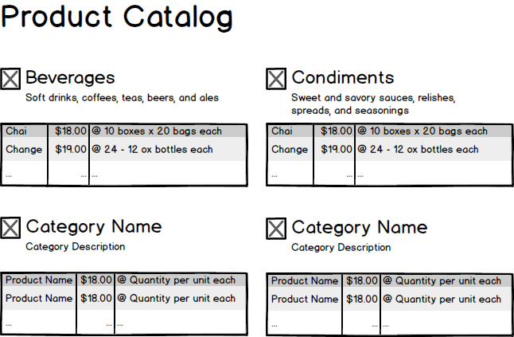

# Product Catalog

Illustrates:

- Simple LINQ query to object graph
- ObjectDataSource
- Nested Repeaters



## BLL

Linq Query:

```csharp
from cat in context.Categories
select new ProductCategory
{
    CategoryName = cat.CategoryName,
    Description = cat.Description,
    Picture = cat.Picture,
    MimeType = cat.PictureMimeType,
    Products = from item in cat.Products
              select new ProductSummary
              {
                  Name = item.ProductName,
                  Price = item.UnitPrice,
                  Quantity = item.QuantityPerUnit
              }
}
```

## Web Form

Object Data Source:

```xml
<asp:ObjectDataSource ID="CategoryDataSource" runat="server"
    OldValuesParameterFormatString="original_{0}"
    SelectMethod="ListCurrentProducts"
    TypeName="WestWindSystem.BLL.ProductManagementController">
</asp:ObjectDataSource>
```

Nested Repeater:

```xml
<asp:Repeater ID="CategoryRepeater" runat="server"
      DataSourceID="CategoryDataSource"
      ItemType="WestWindSystem.DataModels.ProductCategory">
    <ItemTemplate>
        " />
        <h3><%# Item.CategoryName %></h3>
        <p><%# Item.Description %></p>
        <blockquote>
            <asp:Repeater ID="ProductRepeater" runat="server"
                  DataSource="<%# Item.Products %>"
                  ItemType="WestWindSystem.DataModels.ProductSummary">
                <HeaderTemplate>
                    <table class="table table-hover table-condensed">
                </HeaderTemplate>
                <FooterTemplate>
                    </table>
                </FooterTemplate>
                <ItemTemplate>
                    <tr>
                        <th class="col-md-3"><%# Item.Name %></th>
                        <th class="col-md-2" style="text-align: right;"><%# $"{Item.Price:C}" %></th>
                        <th class="col-md-1"></th>
                        <th class="col-md-6"><%# Item.Quantity %></th>
                    </tr>
                </ItemTemplate>
            </asp:Repeater>
        </blockquote>
    </ItemTemplate>
</asp:Repeater>
```
